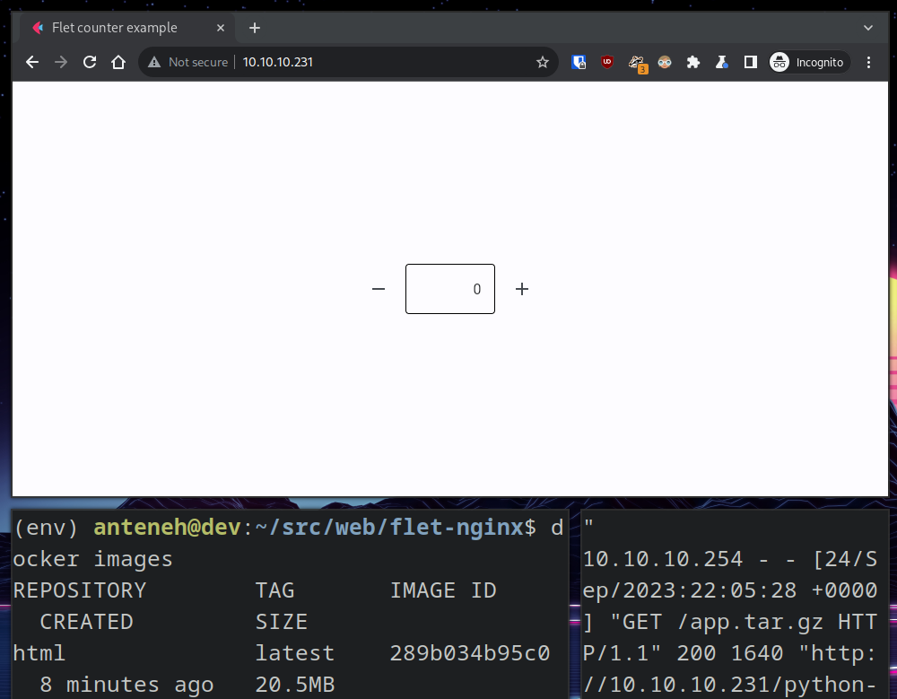

# flet-nginx

## About flet-nginx

Deploy a flet static website to NGINX!

## Built With

+ python3
+ flet

## Getting Started

To get a local copy up and running follow these steps.

### Prerequisites

+ python3
+ pip3

### Installation

This template doesn't rely on any external dependencies or services.
1. clone the repo
```shell
https://github.com/kidistbedilu/flet-nginx.git && cd flet-nginx
```
2. create and activate virtual environment
```shell
virtualenv env && source env/bin/activate
```
3. install flet module
```shell
pip install -r requirements.txt 
```

### Usage

1. run counter app
```shell
python main.py
```
2. publish flet static website under `./dist` directory
```shell
flet publish main.py
```
3. test the static website using Python's built-in [`http.server` module](https://docs.python.org/3/library/http.server.html)
```shell
python -m http.server --directory dist
```
4. test the static website using [NGINX](https://www.nginx.com/)

   4.1. build Docker image
    ```shell
    docker built . -t app-name
    ```
    4.2. run container at port 80
    ```shell
    docker run -p 80:80 app-name
    ```
5. test the static website using [flet-nginx package](https://github.com/kidistbedilu/felt-nginx/pkgs/container/flet-nginx)

   5.1 pull image
   ```shell
   docker pull ghcr.io/kidistbedilu/flet-nginx:latest
   ```
   5.2 run container at port 80
   ```shell
   docker run -p 80:80 ghcr.io/kidistbedilu/flet-nginx:latest
   ```

counter-app screenshot.


## Roadmap

- [x] counter app
- [x] deploy to NGINX
- [x] Dockerize  
    - [x] Publish Docker image to GitHub container registry

> See the [open issues](https://github.com/kidistbedilu/flet-nginx/issues) for a full list of proposed features and known issues.

## Contributing

Any contributions you make are greatly appreciated. If you have a suggestion that would make this better, please fork the repo and create a pull request. Don't forget to give the project a star! Thanks again!!!

1. fork the project
2. create your feature branch `git checkout -b feature/amazing-feature`
3. commit your changes `git commit -m 'feat: add amazing feature'` use the [conventional-commit](https://www.conventionalcommits.org/en/v1.0.0/) specification
4. push to the branch `git push origin feature/amazing-feature`
5. open a pull request

## Contact

Kidist Bedilu | [kidistbedilu.com](kidistbedilu.com) | [me@kidistbedilu.com](me@kidistbedilu.com) | [@kidistbedilu](@kidistbedilu)

## License

Distributed under the [MIT License](https://opensource.org/license/mit/).

